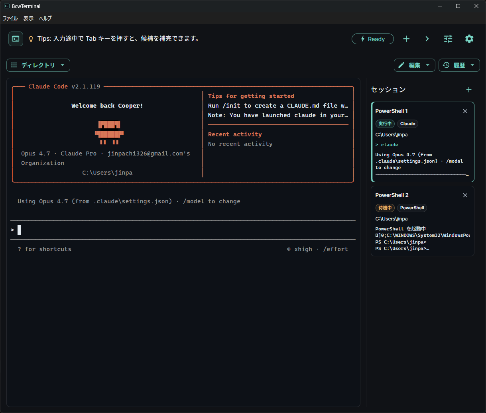

# BcwTerminal

Windows 上で動く、自分専用の開発ターミナルダッシュボードです。
Windows Terminal を完全に置き換えるのではなく、よく使うコマンドをワンクリックで叩けるよう拡張した PowerShell ラッパーです。

## スクリーンショット

## 主な機能

- **PowerShell セッション管理**: 複数のターミナルを作成し、サイドバーから切り替えできます。
- **コマンドショートカット**: Claude / ChatGPT / Git / ls / dir / Network など、よく使うコマンドをボタンから実行できます。
- **コマンド管理**: ボタン名やコマンド内容を画面から編集し、自分用のコマンドグループを追加できます。
- **編集メニュー**: 選択範囲コピー、貼り付け、ターミナル出力保存、Ctrl+C 送信、画面クリアをまとめて操作できます。
- **右クリックコピー**: ターミナル上の選択範囲を右クリックでクリップボードへコピーできます。
- **コマンド履歴**: 直近の実行コマンドを履歴から再実行できます。不要になった履歴はクリアできます。
- **ヘッダー Tips**: ターミナルの小技を定期的に表示します。更新がある場合は更新案内を優先表示します。
- **自動更新**: GitHub Releases で公開された新しいバージョンをアプリ内から確認・適用できます。
- **設定**: 表示言語、フォント、文字色、背景色、サイドバー表示、最前面固定などを変更できます。

## 必要環境

- Windows 10 / 11
- PowerShell 5.1 以上

現状は Windows 専用です。macOS / Linux には対応していません。

## 入手方法

GitHub Releases から Windows 用の実行ファイルをダウンロードして利用します。

- 通常利用には `BcwTerminal-setup-<version>.exe` をおすすめします。
- インストールせずに試したい場合は `BcwTerminal-<version>.exe` を利用できます。
- 自動更新を使う場合は setup 版を利用してください。

## 使い方

1. BcwTerminal を起動します。
2. 必要に応じて `+` ボタンで新しいターミナルを追加します。
3. 左側のコマンドボタンから、よく使うコマンドを実行します。
4. コマンドを編集したい場合は、編集メニューからコマンド管理を開きます。
5. 履歴メニューから、過去に実行したコマンドを再実行できます。
6. ターミナル内容を残したい場合は、編集メニューからターミナル出力を保存します。

## 自動更新

- 設定画面の `アプリ更新` から更新を確認できます。
- 更新が見つかると、ダウンロード後に `更新を適用` で再起動インストールできます。
- ヘッダー Tips に更新案内が表示された場合は、クリックすると設定画面を開けます。
- 自動更新はパッケージ化された Windows アプリで有効です。

## データ保存

- 設定、コマンド設定、履歴はこの PC 内に保存されます。
- ウィンドウサイズ、位置、最大化、最前面状態は次回起動時に復元されます。
- コマンド管理では、コマンド設定を JSON ファイルとして保存・読み込みできます。
- ターミナル出力は UTF-8 のテキストファイルとして保存できます。

## 既知の制限 / 注意

- 現状は Windows + PowerShell 専用です。
- 署名なし配布では、環境によって Smart App Control / Microsoft Defender により実行がブロックされる場合があります。
- 秘密情報を含むコマンドは、履歴や保存したターミナル出力に残らないよう注意してください。

## Windows 注意事項

- Windows 11 の Smart App Control が `ON` の場合、ローカル CLI や一部プロセス起動がブロックされ、ターミナル操作が失敗することがあります。
- コマンド起動に失敗する場合は、Smart App Control を `OFF` に設定したうえで Windows を再起動してください。
- BcwTerminal は起動時に Smart App Control 状態を検知し、`ON` / `評価モード` の場合は設定画面に警告メッセージを表示します。

## ライセンス

MIT License.
